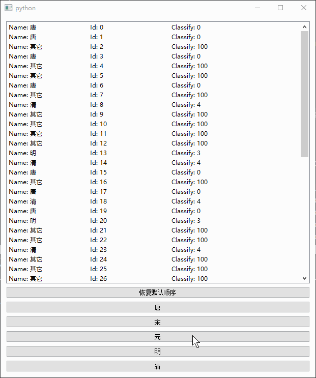

# QListView

## 1. Custom Widget Item
[Run CustomWidgetItem.py](CustomWidgetItem.py)

use `setIndexWidget(QModelIndex, QWidget)` to set custom `QWidget`


## 2. Custom Widget Sort Item
[Run CustomWidgetSortItem.py](CustomWidgetSortItem.py)

1. set QListView proxy model, use `QSortFilterProxyModel`
2. rewrite `lessThan` method to sort


## 3, Custom Role And Sort
[Run SortItemByRole.py](SortItemByRole.py)

Demand:
1. 5 categories(Tang, Song, Yuan, Ming, Qing) and Unclassified
2. selected Tang, the result is Tang, Song, Yuan, Ming, Qing, Unclassified
3. selected Song, the result is Song, Tang, Yuan, Ming, Qing, Unclassified
4. selected Yuan, the result is Yuan, Tang, Song, Ming, Qing, Unclassified
5. Cancel sorting then Restore, like: Unclassified, Tang, Tang, Ming, Qing, Unclassified, Song, Yuan, Unclassified

Method:
1. define `IdRole = Qt.UserRole + 1`            Used to restore default sort
2. define `ClassifyRole = Qt.UserRole + 2`      Used for sorting by sorting number
3. define 5 classify id
    ```python
    NameDict = {
        'Tang': ['Tang', 0],
        'Song': ['Song', 1],
        'Yuan': ['Yuan', 2],
        'Ming': ['Ming', 3],
        'Qing': ['Qing', 4],
    }
    IndexDict = {
        0: 'Tang',
        1: 'Song',
        2: 'Yuan',
        3: 'Ming',
        4: 'Qing',
    }
    ```
4. item `setData(id, IdRole)`           Used to restore default sort
5. item `setData(cid, ClassifyRole)`  Used to record classification
6. inherit `QSortFilterProxyModel` and add `setSortIndex(self, index)` mthod, The purpose is to keep some classify always top
    ```python
    def setSortIndex(self, index):
        self._topIndex = index
    ```
7. inherit `QSortFilterProxyModel` and rewrite `lessThan` mthod, if classify id is equal to top id, then modify it -1
    ```python
    if self.sortRole() == ClassifyRole and \
            source_left.column() == self.sortColumn() and \
            source_right.column() == self.sortColumn():
        # get classify id
        leftIndex = source_left.data(ClassifyRole)
        rightIndex = source_right.data(ClassifyRole)
    
        # AscendingOrder
        if self.sortOrder() == Qt.AscendingOrder:
            # keep always top
            if leftIndex == self._topIndex:
                leftIndex = -1
            if rightIndex == self._topIndex:
                rightIndex = -1
    
            return leftIndex < rightIndex
    ```
8. restore default sort
    ```python
    self.fmodel.setSortRole(IdRole)     
    self.fmodel.sort(0)                 
    ```
9. sort by classify id, must reset `setSortRole` to other
    ```python
    self.fmodel.setSortIndex(1)
    self.fmodel.setSortRole(IdRole)
    self.fmodel.setSortRole(ClassifyRole)
    self.fmodel.sort(0)
    ```

