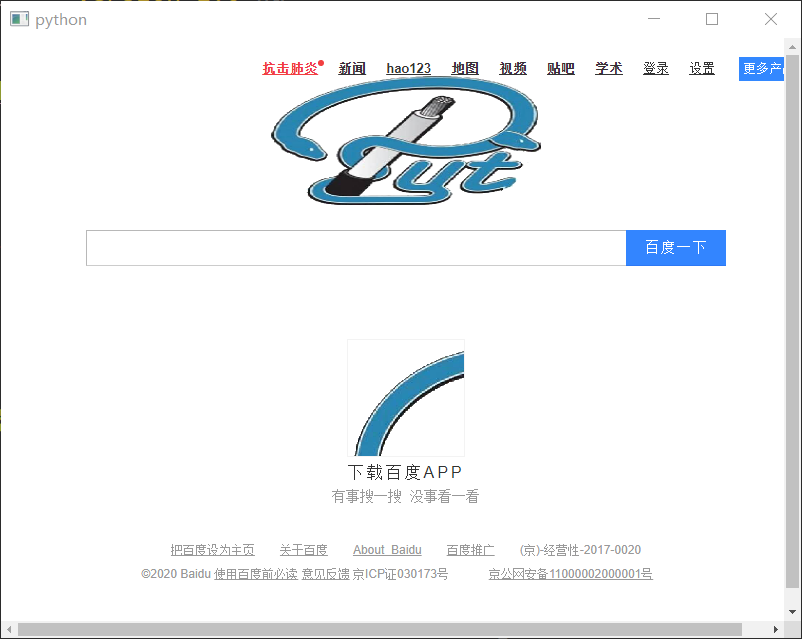

# QWebEngineView

- 目录
  - [获取Cookie](#1获取Cookie)
  - [和Js交互操作](#2和Js交互操作)
  - [网页整体截图](#3网页整体截图)
  - [同网站不同用户](#4同网站不同用户)
  - [拦截请求](#5拦截请求)
  - [拦截请求内容](#6拦截请求内容)

## 1、获取Cookie
[运行 GetCookie.py](GetCookie.py)

通过`QWebEngineProfile`中得到的`cookieStore`并绑定它的`cookieAdded`信号来得到Cookie

## 2、和Js交互操作
[运行 JsSignals.py](JsSignals.py)

通过`qwebchannel.js`和`QWebChannel.registerObject`进行Python对象和Javascript的交互

具体看代码中的注释

## 3、网页整体截图
[运行 ScreenShotPage.py](ScreenShotPage.py)

1. 方式1：目前通过不完美方法（先调整`QWebEngineView`的大小为`QWebEnginePage`的内容大小，等待一定时间后截图再还原大小）
2. 方式2：通过js库`html2canvas`对指定元素截图,得到`base64`编码的数据并调用接口函数传递到py代码中

## 4、同网站不同用户
[运行 SiteDiffUser.py](SiteDiffUser.py)

原理是为每个`QWebEngineView`创建一个`QWebEnginePage`,且使用独立的`QWebEngineProfile`,并配置`persistentStoragePath`不同路径

## 5、拦截请求
[运行 BlockRequest.py](BlockRequest.py)

通过`QWebEngineUrlRequestInterceptor`中的`interceptRequest`方法对每个请求做拦截过滤

## 6、拦截请求内容
[运行 BlockRequestData.py](BlockRequestData.py)

这里用了一个投巧的办法，原理是先通过`QWebEngineUrlRequestInterceptor`中的`interceptRequest`方法对每个请求做拦截过滤，
发现目标url后重定向到`QWebEngineUrlSchemeHandler`实现的自定义协议头返回数据

